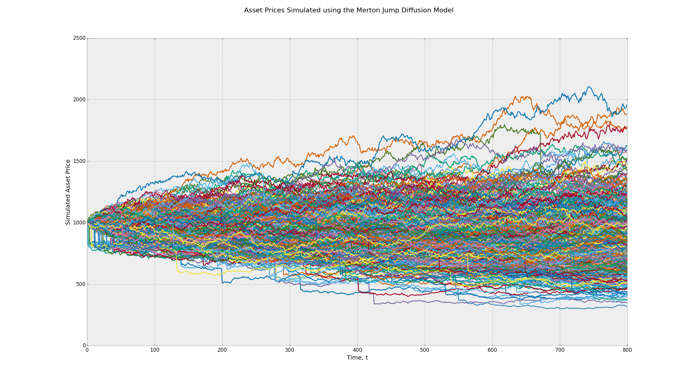
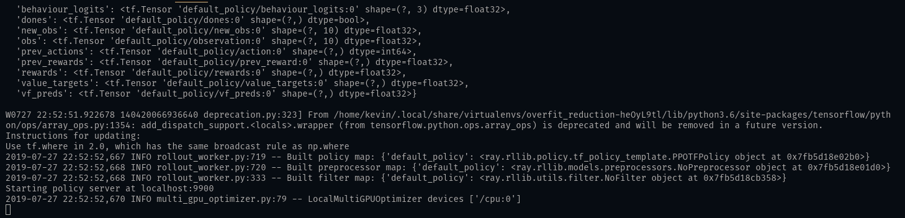

# A Lookahead Free Concurrent Stochastic Environment

Here is a look-ahead bias-free stochastic environment for reinforcement learning. The general idea here is to give the capacity to iterate through multiple episodes at the exact same time to dynamically train a trading agent on a high variation of prices.





## How to Install

We're assuming you already have pip and python installed. Assuming you do, install the environment using the following commands:

```bash
pip install -r requirements.txt
pip install -e . # this installs the setup.py file
```

### How to run test code

To run the example seen in the blog, use the command from the `root` to start the Reinforcement Learning Server.

```bash
python stochastic_agent/rl_server/server.py
```

You should see the RL Server start and it'll look like:



After running the reinforcement learning server, run the command:
```bash
python stochastic_agent/backtester/run.py
```

You'll be able to see exactly what was in the blog.


