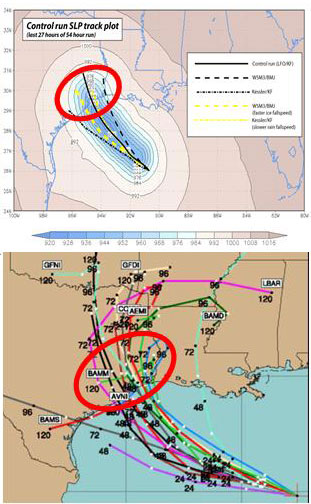
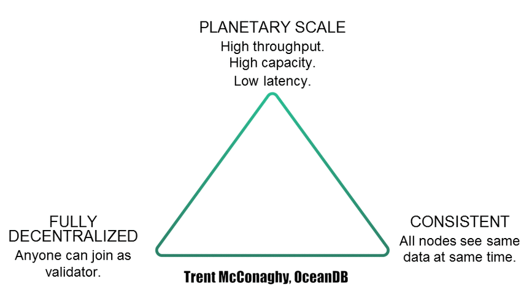

# How to Create A Stochastic Reinforcement Learning Environment For Crypto Trading

After seeing many articles being passed around on the web about trading using reinforcement learning, I decided that I'd release my own article. The general consensus when it comes to reinforcement learning systems in trading enviornments is that they don't really work in real life. 

That's somewhat true. Ultimately, they're online systems that require one to accurately model how the real-world works (at least accurately enough). Without proper means of testing for edge cases, and ensuring the bot doesn't do something extremely horrible in production, reinforcement learning struggles in the real-world. They need constraints and the means to rely on other complex learning techniques. This is especially the case when using reinforcement learning systems in high stakes scenarios. 

Understanding the limitations of reinforcement learning, I've spent time learning how to cover for those limitations. Therefore, in production they don't do anything unexpected. One of the first experiments I  crafted was with using stochastic functions on trading environments to give the reinforcement learning agent generalizability.

At first I was going to create a blog post about older code that highlighted how this was done. The problem I faced was that the code had serious overfit problems and needed to be refactored. Instead I wanted to write about the current environment I've been creating. The shame here is that I won't be publishing all of the code for this. At least, not what's not already public. That's primarily so I can capitalize on the system prior to others intending to duplicate results. I will, however, teach you all how to create the same environment using the separate parts that are open. I will release an older model for shits and gigs.  


There will be major roadblocks you'll face when actually re-creating it. I will eventually release the entire environment under a larger plan I have to use such systems for other bigger and more important reasons than trading. 


## Reinforcement Learning

Deep Reinforcement Learning is basically a little like letting a baby play in the world and spanking it when it did something bad and giving it a lollipop when it did the right thing. After giving a RL agent enough time to play around in the same environment it can learn what the right next action should be and move that direction to avoid a slap and get more lollipops. Okay, let's stop using the idea of smacking babies to show how this can work via a car driving analogy. It'll show how we can use RL for generalized self-driving car risk management.


### The Case By Analogy -- Driving and Accident Risk

Say we're driving a car across the country, and we don't want to get into an accident at every possible point through the course of driving yet we want to get across as quickly as possible with as few stops as possible. There's a few basic rules that we'd likely adopt in order to get from one side of the country to another. The first one would be to always be progressing to our destination, the second would be to avoid terrible road conditions that would destroy the car, move as fast as possible without getting pulled over, and to reduce our risk of accidents as much as possible.

Here are some rules we'll likely see given those objectives inside of a semi-real world:

1. Always be moving towards the goal. The faster it does while not impeding on the other goals, give it a big shiny lollipop.
2. Remaining out of other car's blindspots inside of dense conditions would yield a positive reward (lollipop). Spank that driver when it does rest inside of somebody's blindspot.
    * We could reason that if we give a car enough chances it'll realize that remaining in blindspots increases accident risk and it'll actually try to not do it.
3. Maintaining proper distance from all cars (back and front) would yield a positive reward. Spank it when it's bumper to bumper and it can avoid it.
    * This might cancel out other rules such as moving at the speed limit if cars behind it are quickly approaching it at faster speeds and it'll get stuck bumper to bumper as a consequence.
4. Move extremely fast if there's no cars infront of you, the road is flat, clear, well lit, and well paved (basically deserts and specially built high ways). 
5. When gas stations are sparse fill tank at 50%, no compromise. The closer to 50% if below the better.
6. When gas stations are dense fill take at 25%, no compromise.
7. Don't move fast when there's a possiblity of animals running in front of the car. Spank it if it does
8. Don't move fast when you're likely to slip (snow, rain & steep terrain), as that causes a higher accident risk. 
    * We'd probably have models that represent how certain environment states contribute to accident risk (causal analysis) according to the car's actions


Though there'd likely be more rules, the end results would be a decently moving car if it's combined with pre-existing self-driving logic, and it'd work in largely all circumstances. These are the rules I created when I once drove cross country alone and I had 0 accidents. 


Once you give it this set of logic and let it loose, it can work generally, instead of just specifically to a single scenario. We could say the same thing in essentially every environment - meaning circumstance we intend to let the bot roam in. 


We want to do the same thing in trading, a general set of rules that will maximize survival, provide consistent profit. One caveat to this is that reinforcement learning absolutely needs to experience a high variation of circumstances prior to getting unleashed into the real-world. OpenAI discovered this when they tried to adopt machine learning from simulation to real robotics. What they discovered was that if they created a perfect simulation, the robot couldn't easily adapt to the real world. It could adapt better if they varied the settings inside of the environment. [The bot could generalize through the variation](https://openai.com/blog/generalizing-from-simulation/). We can slightly imitate that by using stochastic processes to see how an agent would respond in various circumstances. Let's explain stochastic processes and how they fit.


## Understanding Stochastic Processes

Stochastic processes is an accumulation of random variables that help us describe the emergence of a system over time. The power of them is that they can be used to describe all of the world around us. In fact, during early 1900 one of the first active uses of Stochastic Processes was with valuing stock options. It was called a Brownian Motion, developed by a French mathematician named Louis Bachelier. It didn't stop there. Five years later it was adopted by Einstein to model the motion of pollen being moved by individual water molecules on the surface.


Einstein argued that the fact that the pollen didnt take a straight path inside of the water was fundamental proof that molecules exist. He explained that each molecule pushed the pollen's position inside of the water in a slighly different direction. Combined together the pollen seemed to travel in seeminly random ways. In other words, Brownian Motion was used to model the many-body interactions that affect an observed variable. Remember, years earlier, we were able to see that the same ideas were applied to Finance. Louis Bachelier determined that stocks ran using the exact same concepts. Instead of the 2d position of pollen, he determined that the price action of a stock had millions of actors shifting it, and at some point Brownian Motion processes were fully adapted into finance. It's the same idea behind the efficient market hypothesis, where the markets react entirely to new information that's supplied into the market.


Analogy wise, you could say that stochastic processes are a means of statistically imitating `np-complete` problems inside of extremely simple ways, much like how Einstein replicated molecular collisons in the problem in the GIF. Given enough samples it's possible to get variations of possible outcomes. It's usually called `statistical ensembling`, and it's a trick used in many places to model the random/dynamic world.

### Why We Use Stochastic Processes in Finance

When building an algorithm, we will want to see how our algorithm will perform inside of new circumstances outside of what we have already seen inside of feed-forward analysis. In order to do that, we need to see how price can emerge for a given currency (or any financial valuation), then run that same algorithm to test it. We should be able to see how an algorithm performs after using that stochastic process. It usually is a way to vet the algorithm we have. If it's successful in alternative circumstances, we can infer that the algorithm we have will likely be successful as well. So basically statisctial ensembling again, except applied to markets.




## Using Stochastic Processes To Train Reinforcement Learning

Just as we can use stochastic processes to help validate our algorithm, we can also use it to train a reinforcement learning system. This will present the machine with a huge set of possibilities to learn (feeding its data intensive nature), and it'll create a more generalized algorithm prior to training it onto real data. By no means will the methodology be perfect, as this algorithm still has major drawbacks to it, largely that it'll be underfit. I intend to better explore the drawbacks to this environment towards the end of the article. I'll also make suggestions of what can be done for further projects to get what we want. 


So let's dig into it.


### The Event Loop

Video games are the most powerful example of what a gym environment entails. 


#### Pre-cursor OpenAI Gym

Usually we see that an OpenAI gym environment looks like the following:

```py
sample_gym_env = SampleGym()
sample_gym_env.reset()
for _ in range(1000):    
    action = sample_gym_env.action_space.sample()
    # Here we push the action into the environment to see how it'll respond
    observation, reward, done, info = sample_gym_env.step(action)
    if done:
        observation = sample_gym_env.reset()
```

The beautiful part about that gym environment is that it can allow for very complex interactions while moving reasonably fast for low-level environments. Actually my first stochastic environment looked 100% like this. It was a good system to get started and prove what I had done, yet when coding from scratch, you'll see from others online that there's a couple of problems that are generated when creating environments like this.

1. They're difficult to deploy in real-life, as in, creating real systems around these simple abstractions is relatively difficult to do. That's because real systems have a lot of moving parts. Keeping all abstractions inside of a pure `step` system is difficult to work around. In other words, they don't replicate real life very well. 
2. They can be slow for extremely dynamic environments if not run in parallel. This is absolutely terrifying when training, and just as terrifying when you're trying to run the system on an entire `universe` of possibilities with systems that have a lot of moving parts like seen in statistical ensembling.
3. It doesn't necessarily allow for more complex environments to be iterated on quickly. Complex meaning parts of the environment that talk to each other (microservices, etc). This is crucial for a trading environment. 
    * When creating a trading enviornment, we have to consider that there will be many interactions between the various parts. For example, getting order sizes for each trade pushing each trade from the portfolio, then checking each trade generated to determine the fill rate and fees could be seen as completely separate parts, yet they're entirely part of the same process. 
    * You also might want to pull data from separate processes in order to manage the reward function. For example, if you're trying to limit the number of orders for any given coin, you'll possibly look at the actions over a given number of steps and apply a exponentially negative penality when the orders exceeds a certain amount inside of that period as it's closer to the current step, where the penalty will be higher the more it orders over a given amount. You might also want to look at how your profit and risk changes according to how asset prices have changed inside of that same context, where if the risk and earnings are over a certain amount given the circumstance within a certain time period.

I tried the gym environment I highlighted above. By the time I added all of the contextual programming I mentioned it became exponentially slow. At first I just bared with it, though with essentially every other part I was adding throughout the process, such as preprocessing prices, rebalancing portfolios, and doing order math, the slowness got extremely bad. I searched for some ways to actually speed the process up. It was only after I came across the blog from quantstart about how to create an event driven backtest, did I find something truely unique. My goal was pretty clear - I was going to create a highly parallelized environment that would take the components of OpenAI's gym. 


#### Event Driven Systems

I first ran into the idea of using an event driven system from [QuantStart](https://www.quantstart.com/articles/Event-Driven-Backtesting-with-Python-Part-I). They explain how to create a backtest using the event loop. I should keep in mind that they have a total of 12 parts on it, so I'm not going to repeat all of it here, as I'm certain I'll butcher their expertise on the subject. I will go through a vague overview though. The event loop works a lot like a video game. As you add events inside of the event queue it's processed quickly in the next component. As parts are processed, they have the option to pass new events into the event_queue to continue the pipeline.  


Quantstart highlights the strengths inside of their blog:

> Event-driven systems provide many advantages over a vectorised approach:

>    * Code Reuse - An event-driven backtester, by design, can be used for both historical backtesting and live trading with minimal switch-out of components. This is not true of vectorised backtesters where all data must be available at once to carry out statistical analysis.
>    * Lookahead Bias - With an event-driven backtester there is no lookahead bias as market data receipt is treated as an "event" that must be acted upon. Thus it is possible to "drip feed" an event-driven backtester with market data, replicating how an order management and portfolio system would behave.
>    * Realism - Event-driven backtesters allow significant customisation over how orders are executed and transaction costs are incurred. It is straightforward to handle basic market and limit orders, as well as market-on-open (MOO) and market-on-close (MOC), since a custom exchange handler can be constructed.


This is huge. Not onlt can we use a system like this for backtesting, but we can use a system like this for essentially any simulated environment and create a decision based process for it in a real-like fashion. Hypothetically, if we needed to decide how we'd move people and resources prior to a catastrophic weather event, we could use the exact same system, and interface it to real-world processes. The number of simluations and actions processes could be endless depending on your task. The awesome part here is that we can iterate quickly on the process.

The event loop looks a little like this in python-esuqe psuedo-code: 

```py
event_queue = Queue()

while True:
    while event_queue.qsize() != 0:
        latest_event = event_queue.get()
        if isinstance(latest_event, OpenMenu):
            open_menu(latest_event)
        elif isinstance(latest_event, EscapeKey):
            quit_game(latest_event)
        elif isinstance(latest_event, MoveUp):
            move_player_north(latest_event)

    if is_done == True:
        # You'd break the environment here
        break
```

You'll notice that there's a lot of similarities to Gym's interface, mainly that it moves through a step like interface and it's complete via a boolean value. However, while Gym has problems in coupling, paralliziability, entensibility and is weak in realness through its proxy interface, this type of event loop has the opposite problem. This event-loop system wins by being highly extensible, parallelizable, real-like and decoupled, yet is more complex to deal with. 



If there was a triangle between `simplicity`, `extensibility(parallelizability)`, and `realness` that would be very akin to the cap theorum I would apply it to RL environments here, and Quantstart's system would be firmly in between extensibility and realness.

How is it extensible? Well, simple, we could easily replace each part with something that would extend parallelization, concurrency, machine optimization and distribution; from the number of cores, include GPUs, speedup through C++ & rust, to micro-services, distributing between machines using more complex message  (such as kafka or RabbitMQ) or distributed processing via kubernetes. Each addition to the system could exponentially increase the parallelizability, concurrency & resilience of the training and live processes. 

Did I mention that it'd be quite simple to run the system on live? When moving to live, instead of running fake data through the system and using fake brokers, we would just periodically run real data and push the command through to a real broker. These systems would just adapt to the new data as if it were 100% real, because compared to vectorized system, it can't tell the difference between real and fake data and fake/real-world interactions it's having. 


#### Event Driven Backtester

Now that we've covered how to create real-like systems via event driven systems with an event loop, let's dig a little further into the anonmy of the backtesting system.

The system is usually split into fairly even parts. Again, this is a close paraphrase (copy) of the first QuantStart article, which I'm taking so I can quickly get to the meat of this article, how to use the system to create a close to real training system, even though it won't look a lot like OpenAI's Gym, which has held so many standards. Okay, here we go.

Our event driven backtest will need to have components that handle specific tasks. 

1. Event - The Event is the fundamental class unit of the event-driven system. It contains a type (such as "MARKET", "SIGNAL", "ORDER" or "FILL determines how it will be handled within the event-loop.
2. Event Queue - The Event Queue is an in-memory Python Queue object that stores all of the Event sub-class objects that are generated by the rest of the software.
3. DataHandler - The DataHandler is an abstract base class (ABC) that presents an interface for handling both historical or live market data. This provides significant flexibility as the Strategy and Portfolio modules can thus be reused between both approaches. The DataHandler generates a new MarketEvent upon every heartbeat of the system (see below).
4. Strategy - The Strategy is also an ABC that presents an interface for taking market data and generating corresponding SignalEvents, which are ultimately utilised by the Portfolio object. A SignalEvent contains a ticker symbol, a direction (LONG or SHORT) and a timestamp.
5. Portfolio - This is an ABC which handles the order management associated with current and subsequent positions for a strategy. It also carries out risk management across the portfolio, including sector exposure and position sizing. In a more sophisticated implementation this could be delegated to a RiskManagement class. The Portfolio takes SignalEvents from the Queue and generates OrderEvents that get added to the Queue.
6. Execution Handler - The ExecutionHandler simulates a connection to a brokerage. The job of the handler is to take OrderEvents from the Queue and execute them, either via a simulated approach or an actual connection to a liver brokerage. Once orders are executed the handler creates FillEvents, which describe what was actually transacted, including fees, commission and slippage (if modelled).
7. The Loop - All of these components are wrapped in an event-loop that correctly handles all Event types, routing them to the appropriate component.


As you can see, there's a lot of moving parts there. Let's rephrase that for easier comprehension:

First, Events are the center of the entire system. Events are loaded with information regarding the processing information for each part of the process. Second, all other parts of the system are necessary for determining when to make an action and how to carry out that action. That's literally every part between strategy and execution handler. The data handler is something entirely different. It's more of a process that replicates how we pull data we intend to observe. Inside of OpenAI's gym, that would basically be an observation grabber.

So an even more simplified abstraction for you Deep RL fanboys:

```py
DataHandler() == obs
Strategy() == RLAgent
Portfolio() == env.step()
ExecutionHandler() == env.step()

# this is basically a done check
if bars.continue_backtest == True:
        bars.update_bars()
    else:
        break
```

So you might be wondering why would we go through the extreme efforts of this again. Simple(not really), every single reason I mentioned above. We can literally test everything as if it were real and upgrade iteratively. Piece-by-piece. To get an entire overview of how the system would look from QuantStart's blog, look at their code example below:


```py
# Declare the components with respective parameters
bars = DataHandler(..)
strategy = Strategy(..)
port = Portfolio(..)
broker = ExecutionHandler(..)

while True:
    # Update the bars (specific backtest code, as opposed to live trading)
    if bars.continue_backtest == True:
        bars.update_bars()
    else:
        break
    
    # Handle the events
    while True:
        try:
            event = events.get(False)
        except Queue.Empty:
            break
        else:
            if event is not None:
                if event.type == 'MARKET':
                    strategy.calculate_signals(event)
                    port.update_timeindex(event)

                elif event.type == 'SIGNAL':
                    port.update_signal(event)

                elif event.type == 'ORDER':
                    broker.execute_order(event)

                elif event.type == 'FILL':
                    port.update_fill(event)

    # 10-Minute heartbeat
    time.sleep(10*60)
```


## Diving Into Code

Before we jump into the deep end, lets go through an overview of what code will be explained for the reader here:

1. How to create a concurrent reinforcement learning pipeline.
2. How to test stochastic data
3. How to attach a reinforcement learning agent to make an action (without much means to)
4. How to monitor the rewards given to the agent (tested using random)

What we wont cover:

1. How to create a profitable algorithm
2. How to create a profitable algorithm
3. How to create all of the parts to create profitable algorithms
4. Reward Design (at least not yet) - Same as creating profitable algorithms
5. Other forms of parallelization
6. How to create any other kinds of services outside of what's seen here.

Also, for good measure, I forgot to mention one more thing we `wont` be doing here:

1. How to create a profitable algorithm

If you say I did something useless because it's not profitable I will inappropiately ask to get you banned (and probably denied) and curb stomp my head against the keyboard of my laptop (somehow), because that's seriously not the purpose of this blog. If you make the comment you clearly can't read (I kid).


Awesome, okay then now that we've covered that, let's actually get to the really useful parts; the parts that'll actually work and will allow you to walk away with something useful. I want to leave you the reader with some runnable code so you can run amok and modify for your own purposes. That means giving everything that wont be considerably dangerous away, which I already have done. See, I've already open sourced many of the components of my current training/backtesting system inside of the [`funguauniverse`](https://github.com/kivo360/funguauniverse) codebase months ago. I'm documenting the parts I released now through this blog. That's for multiple reasons. Partially because documentation is a time sink (albeit a useful one), partially because I was terrified of documenting everything early under the prospect that my work would be built upon without enabling me to capitalize on it, and partially because I see that creating highly interactive environments in the future will be extremely necessary for every function in society. For all I know, the probability that something big will come out of this is likely small. I still thought now was the right time to share. 


Okay, back to the code. Inside of the `funguauniverse` package you'll see that there's one notable module I'm basing a lot of this tutorial around.


1. A pipeline node [shown here](https://github.com/kivo360/funguauniverse/blob/master/funguauniverse/utils/pipeline/pipenode.py). It's largely responsible for passing and processing messages inside of the training process. It provides a sense of concurrency to the training process. That's so if you intended to run multiple episodes, you could easily run multiple episodes at the exact same time. 

For reinforcement learning I'll be using `ray`, and for logging I'll be using `influxdb` to monitor stuff. 

Again, I won't be including a vast majority of the stuff necessary to turn this into a working algorithm (see 5 points above). That's your responsibility from here.

### A Toy Problem

We're gonna go through a toy problem. The objective is simple. We run an online learning regressor on stochasticly generated prices (supplied to us via blog), feed that prediction into a separate RL learning process to get an action, store that action in a background process, then we're gonna parallelize that process to make it really bloody fast. After I finish some more important stuff in the current system I'm going to blog about other more extensive parts. 

#### Reinforcment Learning Library [RLLib FTW]

Ray and RLLib is a highly distributed training library that can include GPUs in the process. Potetnially 1000s of GPUs at the exact same time to train. This is beautiful for all sorts of reasons. We can run a test and scale up whenever we want. Let's look into how it works. We'll be sampling from RLLib's policy server code. We want to have a [PolicyServer](https://ray.readthedocs.io/en/latest/rllib-training.html#ray.rllib.utils.policy_server.PolicyServer) to allow us to keep the code away from everything else while running it inside of production. They provided a sample script for how to create a policy server, we're just gonna adjust some names, play with some

Don't forget to install ray first:

```py
pip install ray
```

```py
from __future__ import absolute_import
from __future__ import division
from __future__ import print_function
"""Example of running a policy server. Copy this file for your use case.

To try this out, in two separate shells run:
    $ python cartpole_server.py
    $ python cartpole_client.py
"""

import os
from gym import spaces
import numpy as np

import ray
from ray.rllib.agents.ppo import PPOAgent
from ray.rllib.env.external_env import ExternalEnv
from ray.rllib.utils.policy_server import PolicyServer
from ray.tune.logger import pretty_print
from ray.tune.registry import register_env

SERVER_ADDRESS = "localhost"
SERVER_PORT = 9900
CHECKPOINT_FILE = "last_checkpoint.out"


class TradingServing(ExternalEnv):
    def __init__(self):
        ExternalEnv.__init__(
            self, spaces.Discrete(3), #discrete state == [0, 1, 2] or sell, hold, buy
            spaces.Box(low=-100, high=100, shape=(10, ), dtype=np.float32)) # we'll take an NP array of 10 positions between -100, and 100 to train

    def run(self):
        print("Starting policy server at {}:{}".format(SERVER_ADDRESS,
                                                       SERVER_PORT))
        server = PolicyServer(self, SERVER_ADDRESS, SERVER_PORT)
        server.serve_forever()


if __name__ == "__main__":
    ray.init()
    register_env("srv", lambda _: TradingServing())

    # We use PPO since it supports off-policy actions, but you can choose and
    # configure any agent.
    ppo = PPOAgent(
        env="srv",
        config={
            # Use a single process to avoid needing to set up a load balancer
            "num_workers": 0,
            # "num_gpus": 1
            # We can set GPUs later ... dog ... keep it real.
            # Configure the agent to run short iterations for debugging
            # "exploration_fraction": 0.01,
            # "learning_starts": 100,
            "timesteps_per_iteration": 200,
            "model": {"use_lstm": True}
        })

    # Attempt to restore from checkpoint if possible.
    if os.path.exists(CHECKPOINT_FILE):
        checkpoint_path = open(CHECKPOINT_FILE).read()
        print("Restoring from checkpoint path", checkpoint_path)
        ppo.restore(checkpoint_path)

    # Serving and training loop
    while True:
        print(pretty_print(ppo.train()))
        checkpoint_path = ppo.save()
        print("Last checkpoint", checkpoint_path)
        with open(CHECKPOINT_FILE, "w") as f:
            f.write(checkpoint_path)
```

You'll see the server inside of `rl_server/server.py`. You can run it using your friendly neighborhood command `python server.py`. That should start up the server to train the environment on. Once we're done with that simple setup we're going to then get it connected to the actual training situation. 


When you run it, it should look like the GIF below:


### Code Parts

1. Daemon Thread Classes


To ensure we can have a consistent concurrency we turn on a thread and only turn it off when the program stops. This is basically a [pipeline node](https://github.com/kivo360/funguauniverse/blob/master/funguauniverse/utils/pipeline/pipenode.py)

```py
class EventProcessor(PNode):

    def __init__(self, event_queue, *args, **kwargs):
        """
            # PNode
            ---
            kwargs:
                - event_queue: A required event queue for the pipenode
                - interval: The number of seconds between each part of the process 
        """
        pass


event_queue = Queue()
event_processor = EventProcessor(event_queue)

event_processor.push(event)
```

The point of the processing events is to process the given circumstance concurrently. Meaning we accept events from the previous parts while we're processing them here. You'll get to see us use futures as a way to to do publish events inside of these event processors and monitor them for maximum concurrency.

We start a bunch of these things to delegate tasks off to using the push method.


